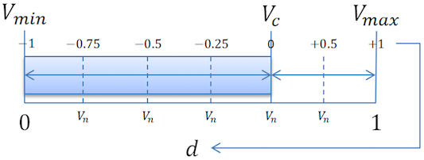

### MMSS2021
# 2. Hausaufgabe - SSE

### Aufgabe

Erstellen Sie eine Terminalanwendung, die eine Bitmap-Datei einliest, die Helligkeit des Bildes verändert (Aufhellen oder Abdunkeln) und das manipulierte Bild mit neuem Namen speichert.

Nutzen Sie dazu die in der Vorlesung vorgestellte Bitmap-Bibliothek. Die Bibliothek können Sie hier finden: [https://github.com/EndoplasmaticReticulum/bitmap](https://github.com/EndoplasmaticReticulum/bitmap)

Das Aufhellen/Abdunkeln des Bildes soll im HSV-Farbraum (oder einem vergleichbaren Farbraum mit Helligkeitskomponente) in folgender Form geschehen, wobei _Vc_ dem aktuellen Helligkeitswert entspricht und _Vn_ möglichen neuen Helligkeitswerten in Abhängigkeit vom Parameter _d_:

Leiten Sie aus der Abbildung eine Formel her, welche Ihnen _Vn_ in Abhängigkeit von _Vc_ und _d_ liefert. Nutzen Sie diese Formel anschließend für die Aufhellung bzw. Abdunklung des Bildes.

Die Berechnung soll mit Hilfe von SSE Intrinsics (beliebige Version) erfolgen, wobei immer 4 Berechnungen gleichzeitig vorgenommen werden sollen.

Die Hausaufgabe ist in Gruppen (idR 3 Personen) zu bearbeiten. Die Hausaufgaben-Gruppen sind zugleich die Projektgruppen für die Prüfungsleistung.

Legen Sie Wert auf eine gute Dokumentation Ihres Codes (Kommentare), saubere Formatierung und einheitlichen Stil.

### Bonus
Die oben illustrierte Berechnungvorschrift lässt sich bei korrekt hergeleiteter Formel mit Hilfe von AVX2 (Stichwort _FMA3/4_) weiter beschleunigen.

Geben Sie Ihrem Programm die Möglichkeit von AVX2 Gebrauch zu machen. Prüfen Sie zunächst, ob der Prozessor in der Lage ist, AVX2-Instruktionen auszuführen. Sollte dies nicht der Fall sein, soll die Berechnung auf herkömmliche Weise (SSE) erfolgen.

Ihr Programm soll zur Laufzeit entscheiden, ob es mit SSE- oder AVX2-Instruktionen arbeitet.

### Bonus Bonus (schwer!)
Schauen Sie sich den Code im Ordner code_01/03_mandel an und setzen Sie die entsprechende Funktionalität mit SIMD-Intrinsics um.

### Abgabe
Die Hausaufgabe muss bis zum 11.05.2021 23:59 Uhr per Mail an [treumer@tu-freiberg.de]() gesendet werden, wenn sie gewertet werden soll. In den Anhang der Mail kommt ihre .c/.h Dateien. Wenn Sie mehrere Quellcode-Dateien senden wollen, packen Sie diese in ein zip-Archiv. Um uns die Korrektur zu erleichtern, bietet sich ein Makefile an. Bitte löschen Sie alle Binärdaten (Object-Dateien, Executables) bevor Sie Ihre Dateien packen.

Als Betreff ist folgendes anzugeben:

_MMSS2021 2. Hausaufgabe_

Geben Sie in der Mail unbedingt alle Gruppenmitglieder (Vor- und Nachname) an. Die Gruppen sollten sich ab der Abgabe der ersten Hausaufgabe nicht mehr ändern.