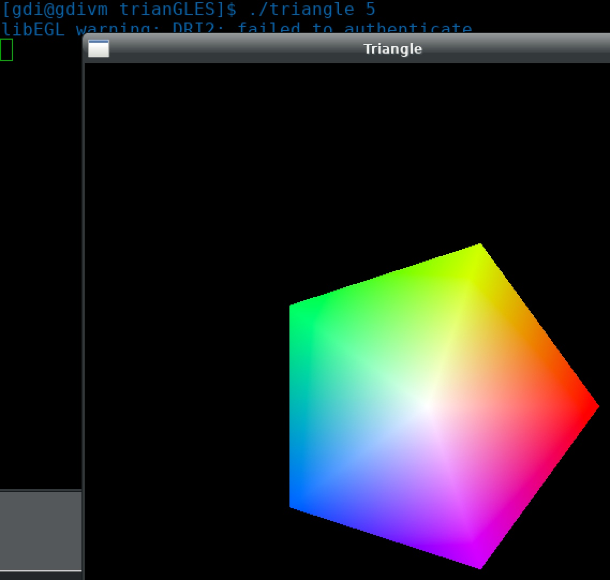

### MMSS2021
# 5. Hausaufgabe - OpenGL

### Aufgabe

Erstellen Sie eine Terminalanwendung, die mithilfe von OpenGL ein regelmäßiges *n*-Eck erzeugt. Die Anzahl der Ecken soll als Kommandozeilenparameter an das Programm übergeben werden. Das *n*-Eck soll so eingefärbt werden, dass sich am Rand annähernd der Farbkreis des HSV-Farbraums ergibt.

Regelmäßiges 5-Eck:

Regelmäßiges 36-Eck:

> Hinweis1: Erstellen Sie die Geometrie nur einmalig beim Start des Programms.

> Hinweis2: Schauen Sie sich die Varianten des ersten Parameters der `glDrawArrays()`-Funktion an. Eine gut gewählte Primitive vereinfacht die Aufgabe.

Die Hausaufgabe ist in Gruppen (idR. 3 Personen) zu bearbeiten. Die Hausaufgaben-Gruppen sind zugleich die Projektgruppen für die Prüfungsleistung.

Legen Sie Wert auf eine gute Dokumentation Ihres Codes (Kommentare), saubere Formatierung und einheitlichen Stil.

### Bonus
Lassen Sie den Farbkreis (nicht die Geometrie) rotieren. Dazu müssen Vertex-Daten in jedem Frame verändert und auf die Grafikkarte kopiert werden. Wir schauen uns in der nächsten Veranstaltung an, wie sich das eleganter lösen lässt. Die Rotationsgeschwindigkeit soll mit Hilfe einer Tastatureingabe (zB: +/-) angepasst werden können.

### Abgabe
Die Hausaufgabe muss bis zum 22.06.2021 23:59 Uhr per Mail an [treumer@tu-freiberg.de]() gesendet werden, wenn sie gewertet werden soll. In den Anhang der Mail kommen ihre `.c`-/`.h`-Dateien. Wenn Sie mehrere Quellcode-Dateien senden wollen, packen Sie diese bitte in ein zip-Archiv. Ein Makefile ist gern gesehen ;)

Als Betreff ist folgendes anzugeben:

_MMSS2021 5. Hausaufgabe_

Geben Sie in der Mail unbedingt alle Gruppenmitglieder an. Die Gruppen sollten sich ab der Abgabe der ersten Hausaufgabe nicht mehr ändern.
